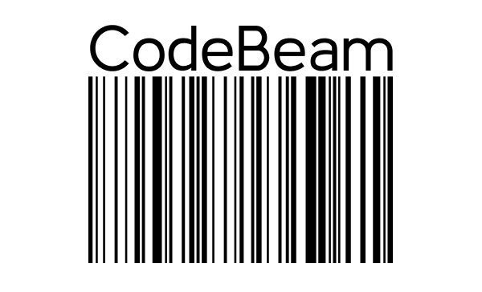

# Code Beam




> Develop barcodes in a hassle-free way with this Python project. "Code Beam" is the key to transforming data into impactful visuals without the hassle of complex code.

### Adjustments and improvements

The project is under development. Next updates will focus on the following tasks:

- [ ] Unitary tests
- [ ] FrontEnd
- [ ] QR code generator

## 💻 Pré-requisitos

Antes de começar, verifique se você atendeu aos seguintes requisitos:

- Você instalou a versão mais recente de [Python](https://www.python.org/).

## 🚀 Instalando Build My World

Para instalar, siga estas etapas:

Linux e macOS:

```
pip3 install
```

Windows:

```
pip3 install
```

## ☕ Usando Code Beam

Para usar, siga estas etapas:

```
python run.py
```


## 🤝 Collaborators

<table>
  <tr>
    <td align="center">
      <a href="#" title="Caio">
        <br>
        <sub>
          <b>Caio Cunha</b>
        </sub>
      </a>
    </td>
  </tr>
</table>


## 📝 License

This project is under license. See the file [LICENSE](LICENSE.md) for more details.